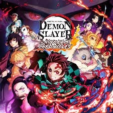

<!DOCTYPE html>
<html lang="en">
<head>
    <meta charset="UTF-8">
    <meta name="viewport" content="width=device-width, initial-scale=1.0">
    <title>Document</title>
</head>
<body>
    <header>
        <h1> Demon Slayer</h1>
    </header>
    <section>
        <table>
            <tr>
                <td>
        
                </td>
                <td>
         <nav>
            <ul>
                <li>
                    <a href="#storyline">storyline</a>
                </li>
                <li>
                    <a href="#characters">characters:</a>
                </li>
                <li>
                    <a href="#Awards and Recognition">Awards and Recognition</a>
                </li>
                <li>
                <a href="#sequels">sequels</a>
                </li>
                <li>
                    <a href="#Most Frequently Asked Questions"> Frequently Asked Questions:</a>
                </li>
            </ul>
         </nav>
                </td>
            </tr>
        </table>
    </section>

    <section>
        <h2>About Demon Slayer</h2>
        
Demon Slayer: Kimetsu no Yaiba is a Japanese anime series about a young boy who becomes a demon slayer to avenge his family and cure his sister who has been turned into a demon: 
            Demon Slayer: Kimetsu no Yaiba (鬼滅の刃, Kimetsu no Yaiba, rgh. "Blade of Demon Destruction")[4] is a Japanese manga series written and illustrated by Koyoharu Gotouge. It was serialized in Shueisha's shōnen manga magazine Weekly Shōnen Jump from February 2016 to May 2020, with its chapters collected in 23 tankōbon volumes. It has been published in English by Viz Media and simultaneously on the Manga Plus platform by Shueisha. It follows teenage Tanjiro Kamado, who strives to become a Demon Slayer after his family was slaughtered and his younger sister, Nezuko, is turned into a demon.
        

    </section>

    <section id="storyline">
        <h2>storyline:</h2>
        

            In Taishō era Japan, a secret organization known as the "Demon Slayer Corps" has waged a war against demons for centuries. Demons are former humans who possess supernatural abilities such as enhanced strength, rapid regeneration, and unique powers referred to as "Blood Demon Arts". Demons can only be killed if they are exposed to direct sunlight, decapitated with weapons crafted from an alloy called Nichirin, or injected with a poison extracted from wisteria flowers.

            In contrast, the Demon Slayers are entirely human but employ specialized elemental breathing techniques known as "Breathing Styles". These techniques grant them superhuman strength, heightened abilities, and increased resilience that enable them to fight demons effectively. The most formidable Demon Slayers are known as the "Hashira" and gain this title through multiple advancements in the Corps' ranks, culminating in killing fifty demons at the highest level or a member of the Twelve Kizuki.
        

      <audio src="kamado_tanjiro_no_uta.mp3" controls></audio>
      <iframe src="https://www.youtube.com/embed/lEkLJX0q6gs" width="350" height="250" ></iframe>
    </section>

    <section id="characters">
        <h2>characters:</h2>
        

            <ul>
                <li>Tanjiro Kamado: A main character in the series.
                    <a href="https://en.wikipedia.org/wiki/Tanjiro_Kamado">Tanjiro_Kamado</a>
                </li>
                <li>Nezuko Kamado: A main character in the series.
                    <a href="https://en.wikipedia.org/wiki/Nezuko_Kamado">more about Nezuko </a>
                     </li>
                <li>Zenitsu Agatsuma: A main character in the series</li>
                <li>Inosuke Hashibira: A main character in the series. </li>
                <li>Genya Shinazugawa: A main character in the series. </li>
                <li>Kyojuro Rengoku: A secondary character and the Flame Hashira, one of the nine Hashira in the Demon Slayer organization. He is a powerful fighter who can defeat strong demons with ease. </li>
                <li>
                    Kanao Tsuyuri: A talented young female demon slayer who is mysterious and rarely talks. She is often hard to understand emotionally, but always smiles calmly
                </li>
                <li>
                    Gyomei Himejima: A recurring character and the Stone Hashira of the Nine Pillars in the Demon Slayer Corps. He is known for his swordsmanship and powerful attacks. 
                </li>
            </ul>
        

    </section>

    <section id="Awards and Recognition">
        <table>
            <tr>
                <td>
                    <h2>        Awards and Recognition:
                    </h2>
    
                </td>
                <td>
                  
                    
Demon Slayer has won many awards, including:
                        <ul>
                            <li>
                                Anime of the Decade: Won this award in a Funimation poll where fans voted for their favorite anime
                            </li>
                            <li>Animedia Character Awards: Won 11 awards for its characters in 2019, the most awards in a single year in the history of the award</li>
                            <li>
                                Japan Character Awards: Won the Grand Prix award and the New Face Award in 2020 
            
                            </li>
                            <li>
                                Japan Record Awards: Received the Special Achievement Award in 2020 
            
                            </li>
                            <li>
                                Japan Academy Film Prize: Demon Slayer: Kimetsu no Yaiba the Movie: Mugen Train won Best Animation Film, Best Music Score, and Popularity Award in 2021 
            
                            </li>
                        </ul>
                    

                </td>
            </tr>
        </table>
       
      
    </section>

    <section id="sequels">
        <h1>
            Sequels:
        </h1>
  <h2>
    Demon slayer have multiple sequences
  </h2>
  <table>
    <tr>
        <td>
    
        </td>
        <td>
    <h3>Demon Slayer: Kimetsu no Yaiba – To the Swordsmith Village</h3>
    

        This movie was released on February 3, 2023, and is set after the events of the second season. It includes footage from the final two episodes of the Entertainment District Arc, and an advanced screening of the first Swordsmith Village Arc episode.
    

        </td>
        <tr>
            <td>
                
                    </td>
                    <td>
<h3>Demon Slayer: Kimetsu no Yaiba – To the Hashira Training
</h3>

    This movie was released on February 2, 2024, and is set after the events of the third season. 

                    </td>
        </tr>

        <tr>
            <td>
                
            </td>
            <td>
                <h3>Demon Slayer: Mugen Train
                </h3>
                

                    This movie was a sequel to the first season and was adapted into a television arc as part of season 2. The movie is about a demon attack on a train, and Tanjiro and his allies are helped by the Flame Hashira. 
 
                

            </td>
        </tr>
    <tr>
        <td>
           

        </td>
        <td>
            <h3>Kimetsu Academy Story
            </h3>
            

                This spin-off series is inspired by a collection of short stories. It features the anime's characters being transported to another universe and transformed into high school students. 

            

        </td>
    </tr>
    </tr>
  </table>
  <h4> use this link to know more about sequls:
    <a href="https://en.wikipedia.org/wiki/Demon_Slayer:_Kimetsu_no_Yaiba"> sequles:</a>

  </h4>

    </section>

<section id="Most Frequently Asked Questions">
    <h2>    Most Frequently Asked Questions:-
    </h2>
    

        

                      how many hours it would take to complete demon slayer anime?
                      

        The total time you will need to watch this anime is around 9 hours.
       
    

    

        

            Who has the saddest backstory?

        

        Tanjiro Kamado's story is considered one of the most emotionally impactful in the series. A demon attack kills his parents and siblings, shattering his peaceful life in the mountains with his family. 

    

    

        

            What are some of the best fights in Demon Slayer?

        

        <ul>
            <li>Tanjiro and Giyu vs. Akaza 
            </li>
            <li>
                Kanao and Inosuke vs. Doma 

            </li>
            <li>
                Mitsuri Kanroji and Obanai Iguro vs Nakime 

            </li>
        </ul>
    

</section>

<section>
</section>
<section>
    <h2>
        Some Youtube videos:
    </h2>
    <table>
        <tr>
            <td>
<iframe src="https://www.youtube.com/embed/RlebhovwVws" width="350" height="250"></iframe>            </td>
            <td>
<iframe src="https://www.youtube.com/embed/-jzET1Fe3oo" width="350" height="250"></iframe>
            </td>
            <td>
    <iframe src="https://www.youtube.com/embed/kPAb5mV6sUU" width="350" height="250"></iframe>
            </td>
        </tr>
        <tr>
            <td>
<iframe src="https://www.youtube.com/embed/-jzET1Fe3oo"width="350" height="250"></iframe>
            </td>
            <td>
            <iframe src="https://www.youtube.com/embed/BdX2UnQoWfQ"width="350" height="250"></iframe>
            </td>
        </tr>
    </table>
</section>
 
 

<footer>
    Copyright © 2024 Shivam Rai. All Rights Reserved.
</footer>

</body>
</html>
